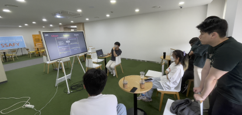

## 🧙 '낭만을 찾아서'

안녕하세요! 프로젝트 **42**를 진행한 *낭만을 찾아서* 팀입니다. 

프로젝트를 마무리하며 기술에 대한 지식과 경험을 나누는 Dev Talk을 진행하였는데요. 
그 크루들과 발표 내용을 간단히 소개해드리고자 합니다. 엄청난 라인업!🙋‍ 

# 인프라

# 프론트엔드
## 디자인 패턴

## 안드로이드

## ios

## 웹

# 백엔드

